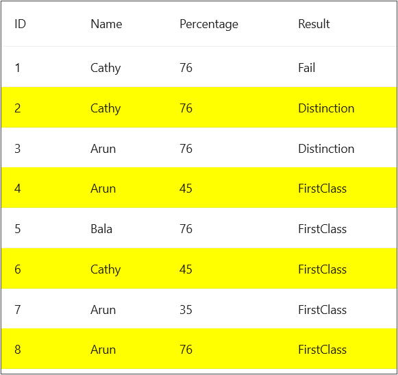

# How to Apply RowStyle in MAUI DataGrid
In.NET [MAUI DataGrid](https://www.syncfusion.com/maui-controls/maui-datagrid) (SfDataGrid) allows you to apply style for the [DataGridCells](https://help.syncfusion.com/cr/maui/Syncfusion.Maui.DataGrid.DataGridCell.html) by using the [DataGridColumn.CellStyle](https://help.syncfusion.com/cr/maui/Syncfusion.Maui.DataGrid.DataGridColumn.html#Syncfusion_Maui_DataGrid_DataGridColumn_CellStyle) property.

 To apply RowStyle for a particular row/rows, you need to apply the same CellStyle for all the DataGridColumns in the row.

## XAML
```XML
<syncfusion:SfDataGrid x:Name="dataGrid"
                           AutoGenerateColumnsMode="None"
                           ColumnWidthMode="Auto"
                     ItemsSource="{Binding Info}">

        <syncfusion:SfDataGrid.Columns>
            <syncfusion:DataGridTextColumn MappingName="ID">
                <syncfusion:DataGridTextColumn.CellStyle>
                    <Style TargetType="syncfusion:DataGridCell">                        
                        <Setter Property="Background" 
                    Value="{Binding ID, Converter={StaticResource colorConverter}}" />
                    </Style>
                </syncfusion:DataGridTextColumn.CellStyle>
            </syncfusion:DataGridTextColumn>

            <syncfusion:DataGridTextColumn MappingName="Name">
                <syncfusion:DataGridTextColumn.CellStyle>
                    <Style TargetType="syncfusion:DataGridCell">
                        <Setter Property="Background" 
                    Value="{Binding ID, Converter={StaticResource colorConverter}}" />
                    </Style>
                </syncfusion:DataGridTextColumn.CellStyle>
            </syncfusion:DataGridTextColumn>

            <syncfusion:DataGridTextColumn MappingName="Percentage">
                <syncfusion:DataGridTextColumn.CellStyle>
                    <Style TargetType="syncfusion:DataGridCell">
                        <Setter Property="Background" 
                    Value="{Binding ID, Converter={StaticResource colorConverter}}" />
                    </Style>
                </syncfusion:DataGridTextColumn.CellStyle>
            </syncfusion:DataGridTextColumn>

            <syncfusion:DataGridTextColumn MappingName="Result">
                <syncfusion:DataGridTextColumn.CellStyle>
                    <Style TargetType="syncfusion:DataGridCell">
                        <Setter Property="Background" 
                    Value="{Binding ID, Converter={StaticResource colorConverter}}" />
                    </Style>
                </syncfusion:DataGridTextColumn.CellStyle>
            </syncfusion:DataGridTextColumn>
        </syncfusion:SfDataGrid.Columns>
    </syncfusion:SfDataGrid>
```

## C#
### Converter
```C#
 public class Converter : IValueConverter
{
    object IValueConverter.Convert(object value, Type targetType, object parameter, CultureInfo info)
    {
        int _value = (int)value;
        if (_value % 2 == 0)
            return Colors.Yellow;
        return Colors.Transparent;
    }
    public object ConvertBack(object value, Type targetType, object parameter, CultureInfo culture)
    {
        throw new NotImplementedException();
    }
}
``` 

## Conclusion
I hope you enjoyed learning about how to apply RowStyle in MAUI DataGrid (SfDataGrid).

You can refer to our [.NET MAUI DataGrid’s feature tour](https://www.syncfusion.com/maui-controls/maui-datagrid) page to know about its other groundbreaking feature representations. You can also explore our .NET MAUI DataGrid Documentation to understand how to present and manipulate data.
For current customers, you can check out our .NET MAUI components from the [License and Downloads](https://www.syncfusion.com/account/downloads) page. If you are new to Syncfusion, you can try our 30-day free trial to check out our .NET MAUI DataGrid and other .NET MAUI components.
If you have any queries or require clarifications, please let us know in comments below. You can also contact us through our [support forums](https://www.syncfusion.com/forums), [Direct-Trac](https://support.syncfusion.com/account/login?ReturnUrl=%2Faccount%2Fconnect%2Fauthorize%2Fcallback%3Fclient_id%3Dc54e52f3eb3cde0c3f20474f1bc179ed%26redirect_uri%3Dhttps%253A%252F%252Fsupport.syncfusion.com%252Fagent%252Flogincallback%26response_type%3Dcode%26scope%3Dopenid%2520profile%2520agent.api%2520integration.api%2520offline_access%2520kb.api%26state%3D8db41f98953a4d9ba40407b150ad4cf2%26code_challenge%3DvwHoT64z2h21eP_A9g7JWtr3vp3iPrvSjfh5hN5C7IE%26code_challenge_method%3DS256%26response_mode%3Dquery) or [feedback portal](https://www.syncfusion.com/feedback/maui?control=sfdatagrid). We are always happy to assist you!
